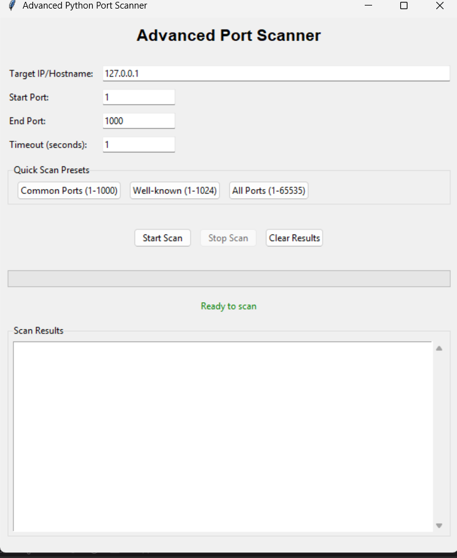

# Advanced Python Port Scanner

A modern, user-friendly port scanner built with Python and Tkinter. This tool allows you to scan a range of ports on a target IP address or hostname, identify open ports, and display common service names. It features a graphical interface, progress tracking, and quick scan presets for convenience.

## Features

- **Graphical User Interface (GUI):** Easy-to-use interface built with Tkinter.
- **Custom Port Range:** Scan any range of ports (1-65535).
- **Quick Scan Presets:** One-click buttons for common, well-known, or all ports.
- **Service Identification:** Maps open ports to common services (e.g., HTTP, SSH, FTP).
- **Progress Bar:** Visual feedback during scanning.
- **Threaded Scanning:** Responsive UI during scans.
- **Input Validation:** Prevents invalid targets or port ranges.
- **Scan Control:** Start, stop, and clear scan results easily.

## Requirements

- Python 3.6+
- Tkinter (usually included with Python)

## Installation

1. **Clone the repository:**
   ```bash
   git clone <repo-url>
   cd 12-hacking-tools-using-python
   ```
2. **(Optional) Create a virtual environment:**
   ```bash
   python -m venv venv
   source venv/bin/activate  # On Windows: venv\Scripts\activate
   ```
3. **Install dependencies:**
   No external dependencies are required beyond Python and Tkinter.

## Usage

1. Run the port scanner:
   ```bash
   python Python_Port_Scanner.py
   ```
2. Enter the target IP address or hostname.
3. Set the port range and timeout, or use a quick scan preset.
4. Click **Start Scan** to begin. Use **Stop Scan** to halt scanning at any time.
5. View results in the output area. Use **Clear Results** to reset.

## Screenshots



## Notes
- Scanning a large range of ports may take significant time depending on network conditions and timeout settings.
- Use responsibly and only scan systems you have permission to test.

## License

This project is for educational purposes. Please check the repository for license details.